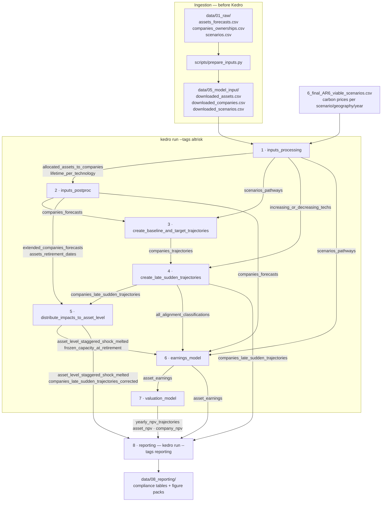
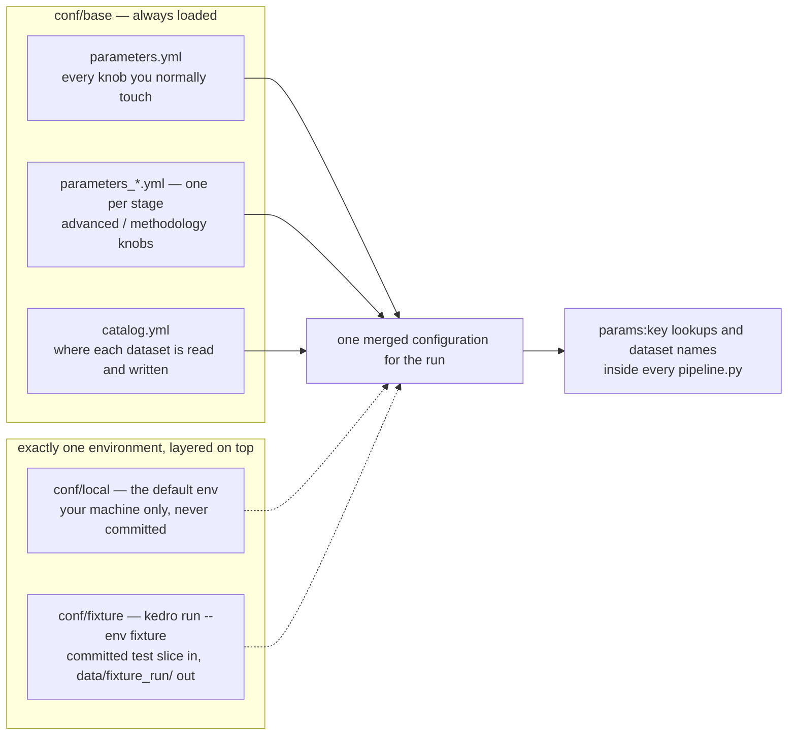

# Architecture

Two maps of the package: how data moves through the eight stages, and how
configuration reaches them. Both are drawn from the code — every arrow below is
a dataset name that appears in some `pipeline.py`, not an idealised sketch.

!!! info "If the diagrams do not appear"
    The built site fetches the mermaid renderer from a CDN the first time a
    diagram is shown. Offline or behind a strict proxy you get the diagram
    source instead, which still reads as a list of arrows; GitHub renders the
    same blocks natively.

## Data flow



### Reading the diagram

* **Arrows are datasets, not calls.** No stage imports another. Kedro derives
  the run order from the dataset names each node declares, so the numbering is
  the dependency order rather than a hand-written schedule.
* **The chain is not a line.** Four stages feed the earnings model directly:
  the scenario table jumps 1 → 6, the asset-level input table 2 → 6, the
  alignment classification 4 → 6. Reporting reads from stages 4, 5, 6 and 7.
  Deleting an "obviously intermediate" table therefore breaks something two
  stages further down.
* **`--tags altrisk` stops after stage 7.** Stage 8 carries the `reporting`
  tag. Run `kedro run --tags altrisk,reporting`, or `kedro run --pipeline full`,
  for the whole thing — see [Stage 8](pipelines/reporting.md).
* **The ingestion box is outside Kedro.** `scripts/prepare_inputs.py` is an
  ordinary script, run once by hand before the pipeline
  ([quickstart](quickstart.md)). The carbon-price file is a fourth input read
  straight from the repository root, not something the adapter produces.

## What crosses stage boundaries

The complete hand-off list — the arrows above, with where each table lives
during a run:

| Dataset | Produced by | Read by | Persisted to |
| --- | --- | --- | --- |
| `scenarios_pathways` | 1 | 2, 3, 6 | `data/05_model_output/scenarios_pathways.csv` |
| `allocated_assets_to_companies` | 1 | 2 | `data/07_model_output/allocated_assets_to_companies.csv` |
| `lifetime_per_technology` | 1 | 2 | in memory |
| `increasing_or_decreasing_techs` | 1 | 4 | in memory |
| `companies_forecasts` | 2 | 3, 6 | in memory |
| `extended_companies_forecasts` | 2 | 5 | in memory |
| `assets_retirement_dates` | 2 | 5 | in memory |
| `companies_trajectories` | 3 | 4 | in memory |
| `companies_late_sudden_trajectories` | 4 | 5, 8 | `data/07_model_output/companies_late_sudden_trajectories.csv` |
| `all_alignment_classifications` | 4 | 6 | in memory |
| `asset_level_staggered_shock_melted` | 5 | 6, 8 | in memory |
| `companies_late_sudden_trajectories_corrected` | 5 | 8 | in memory |
| `frozen_capacity_at_retirement` | 5 | 6 | `data/07_model_output/frozen_capacity_at_retirement.csv` |
| `asset_earnings` | 6 | 7, 8 | `data/07_model_output/asset_earnings.csv` |
| `yearly_npv_trajectories` | 7 | 8 | `data/07_model_output/yearly_npv_trajectories.csv` |
| `asset_npv` | 7 | 8 | `data/07_model_output/asset_npv.csv` |
| `company_npv` | 7 | 8 | `data/07_model_output/company_npv.csv` |

Each stage also keeps intermediates that never leave it — the per-stage pages
list them.

!!! note "In memory means gone when the run ends"
    A dataset is written to disk only if `conf/base/catalog.yml` declares a
    `filepath` for it; everything else is a Kedro `MemoryDataset` that exists
    for the duration of one run. That is why restarting mid-pipeline with
    `--from-nodes` usually fails: the node's inputs were never persisted. See
    [Troubleshooting → a re-run picks up stale intermediate data](troubleshooting.md#a-re-run-picks-up-stale-intermediate-data).
    The reporting figures are the mirror-image case — the plot nodes write them
    to `data/08_reporting/` themselves rather than through the catalog, so no
    environment override can redirect them.

## Configuration layout



Three rules follow from that shape:

1. **`conf/base` is always loaded**, and exactly one environment is layered on
   top of it — `local` unless you pass `--env`. Environments override; they do
   not replace. `conf/fixture` overrides three input datasets, every persisted
   output path and two scenario parameters, and inherits the rest from `base`.
2. **All parameter files merge into one flat namespace.** A node asking for
   `params:shock_year` does not care which file defined it, which is why
   `conf/base/parameters.yml` can collect the headline knobs while the advanced
   ones stay next to the stage that uses them. The corollary: a key may be
   defined in **exactly one** file per environment — a duplicate aborts the run.
3. **The catalog is the only place file paths live** (except the reporting
   figure directories noted above). Point the model at different data by
   editing `catalog.yml` or adding an environment, never by editing node code.

Defaults and per-key documentation: [parameters reference](parameters.md).

## Exploring it interactively

The diagram above is stage-level and hand-maintained. For the node-level graph,
read straight from the code and always current:

```bash
kedro viz run
```

It opens a browser UI at `http://127.0.0.1:4141` showing every node, every
dataset and the edges between them; click a node for its inputs, outputs and
parameters, and use the pipeline selector to isolate one stage. Useful flags:

```bash
kedro viz run --pipeline earnings_model   # one stage only
kedro viz run --env fixture               # resolve paths against the fixture env
kedro viz run --no-browser --port 4142    # do not steal focus / port already busy
```

`kedro-viz` is a declared dependency, so `pip install -e .` already installed
it. Stop the server with `Ctrl-C`.
