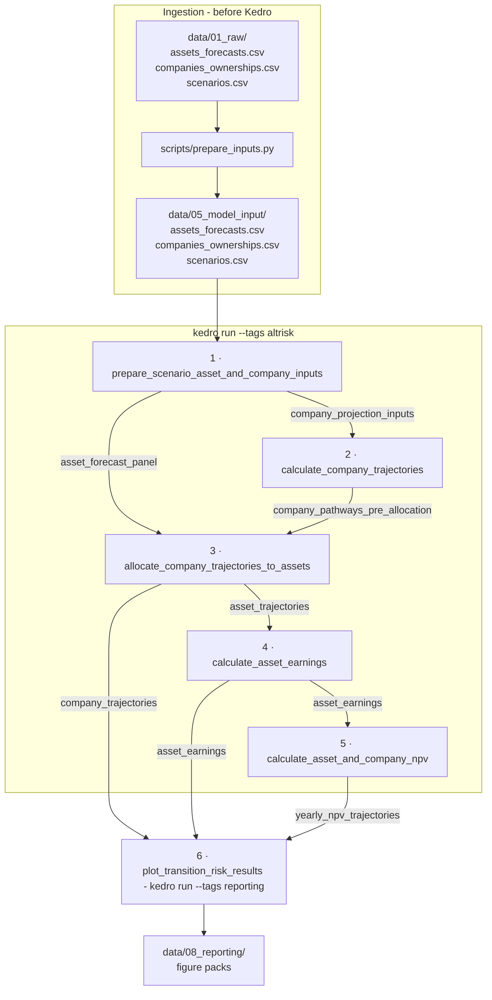
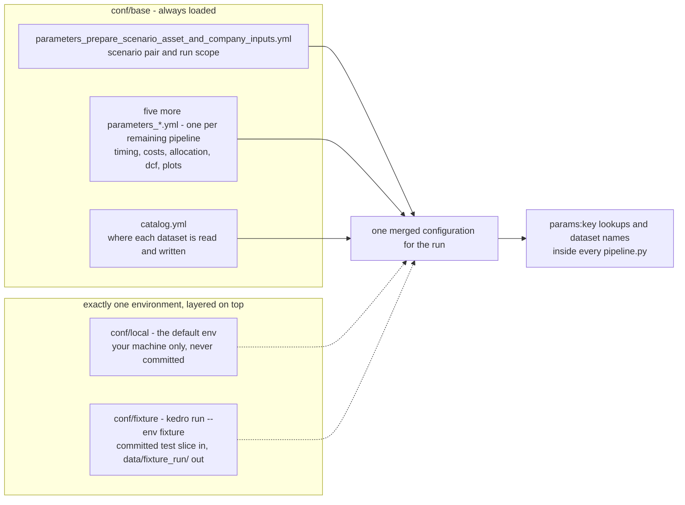

# Architecture

Two maps of the package: how data moves through the six stages, and how
configuration reaches them. Both are drawn from the code - every arrow below is
a dataset name that appears in some `pipeline.py`, not an idealised sketch.

!!! info "If the diagrams do not appear"
    The built site fetches the mermaid renderer from a CDN the first time a
    diagram is shown. Offline or behind a strict proxy you get the diagram
    source instead, which still reads as a list of arrows; GitHub renders the
    same blocks natively.

## The Kedro layer, in four concepts

ALTR runs on [Kedro](https://kedro.org) for orchestration - the tags, the
`kedro run` commands and the batch runners all build on it. Four concepts carry
everything else on this page:

* **Nodes and pipelines.** A node is a Python function with declared inputs and
  outputs; a pipeline wires nodes together. Kedro derives the run order from
  those declarations - nothing schedules by hand.
* **The catalog** (`conf/base/catalog.yml`) declares where each dataset lives
  and how to read and write it. An entry can point at a local CSV *or* a live
  source (a database, a warehouse table) - the node code does not change either
  way, only the entry does.
* **Parameters** (`conf/base/parameters_*.yml`) are the model's tunable inputs,
  injected into nodes as `params:<key>`.
* **Environments** (`conf/<env>/`) layer overrides on top of `conf/base/` -
  the [configuration layout](#configuration-layout) below shows the exact
  merge, and `conf/local/` (gitignored) is the place for your own machine's
  overrides.

!!! note "The model does not depend on Kedro to run"
    The nodes are ordinary functions (`pipelines/*/nodes.py`) that take
    DataFrames and parameters in and return DataFrames out - Kedro's role is
    the wiring, the catalog and `kedro run`, not the modelling logic. If the
    framework ever had to go, the node functions can be called directly from a
    script or notebook with plain pandas DataFrames; nothing in the modelling
    code itself is Kedro-specific.

## Data flow



### Reading the diagram

* **Arrows are datasets, not calls.** No stage imports another *as a stage*;
  Kedro derives the run order from the dataset names each node declares, so the
  numbering is the dependency order rather than a hand-written schedule. (Some
  stages do reuse another's private helper functions - stage 2's
  `_baseline_nodes.py` is imported by stage 1 - but that is code reuse, not a
  graph edge.)
* **The chain is close to a line, and the reporting stage is not.** Stages 1-5
  hand off one dataset at a time; the plotting stage reads from stages 3, 4 and
  5 at once. Deleting an "obviously intermediate" table therefore breaks
  something two stages further down.
* **Each pipeline is namespaced.** Every node name is printed as
  `<pipeline>.<node>`, and every dataset that is not a declared pipeline
  input/output/parameter is namespaced too. The private, namespaced
  intermediates are the ones whose names start with `_`.
* **`--tags altrisk` stops after stage 5.** Stage 6 carries the `reporting`
  tag. A bare `kedro run` runs the default pipeline, which is all six - see
  [Stage 6](pipelines/plot_transition_risk_results.md).
* **The ingestion box is outside Kedro.** `scripts/prepare_inputs.py` is an
  ordinary script, run once by hand before the pipeline
  ([quickstart](quickstart.md)). There is no download pipeline: maintainers
  produce the three input CSVs with the standalone
  `src/altr_model/bigquery_marts_downloader.py`, which is not shipped as part
  of the model graph.

## What crosses stage boundaries

The complete hand-off list - the arrows above, with where each table lives
during a run:

| Dataset | Produced by | Read by | Persisted to |
| --- | --- | --- | --- |
| `asset_forecast_panel` | 1 | 1, 3 | in memory |
| `company_projection_inputs` | 1 | 2 | in memory |
| `company_pathways_pre_allocation` | 2 | 3 | in memory |
| `asset_trajectories` | 3 | 3, 4 | `data/07_model_output/asset_trajectories.csv` |
| `company_trajectories` | 3 | 6 | `data/07_model_output/company_trajectories.csv` |
| `asset_earnings` | 4 | 5, 6 | `data/07_model_output/asset_earnings.csv` |
| `yearly_npv_trajectories` | 5 | 5, 6 | `data/07_model_output/yearly_npv_trajectories.csv` |
| `asset_npv` | 5 | 5 | `data/07_model_output/asset_npv.csv` |
| `company_technology_npv` | 5 | 5 | `data/07_model_output/company_technology_npv.csv` |
| `company_npv` | 5 | - | `data/07_model_output/company_npv.csv` |
| `frozen_capacity_at_retirement` | 3 | 4 | `data/07_model_output/frozen_capacity_at_retirement.csv` |

`frozen_capacity_at_retirement` records, for every asset that retires, the
capacity it last stood at — the year before retirement, since the retirement
year is already zeroed — carried across every year from retirement onward.
Stage 3 produces it because that is where retirement years live; stage 4 merges
it onto the asset panel. Nothing in the earnings maths reads it: fixed costs use
first-year capacity. It is a carried surface, the one a stranded-capacity view
would be built on.

Each stage also keeps intermediates that never leave it - the per-stage pages
list them.

!!! note "In memory means gone when the run ends"
    A dataset is written to disk only if `conf/base/catalog.yml` declares a
    `filepath` for it; everything else is a Kedro `MemoryDataset` that exists
    for the duration of one run. That is why restarting mid-pipeline with
    `--from-nodes` usually fails: the node's inputs were never persisted. See
    [Troubleshooting → a re-run picks up stale intermediate data](troubleshooting.md#a-re-run-picks-up-stale-intermediate-data).
    The reporting figures are the mirror-image case - the plot nodes write them
    to `data/08_reporting/` themselves rather than through the catalog, so no
    environment override can redirect them.

## Configuration layout



Three rules follow from that shape:

1. **`conf/base` is always loaded**, and exactly one environment is layered on
   top of it - `local` unless you pass `--env`. Environments override; they do
   not replace. `conf/fixture` overrides the three input datasets, every
   persisted output path and the scenario pair, and inherits the rest from
   `base`.
2. **All parameter files merge into one flat namespace.** A node asking for
   `params:shock_year` does not care which file defined it, which is why the
   namespace can be split six ways with each key living next to the pipeline
   that consumes it. The corollary: a key may be defined in **exactly one** file
   per environment - a duplicate aborts the run. There is no consolidated
   `conf/base/parameters.yml`; adding one would collide with the six.
3. **The catalog is the only place file paths live** (except the reporting
   figure directories noted above). Point the model at different data by
   editing `catalog.yml` or adding an environment, never by editing node code.

Defaults and per-key documentation: [parameters reference](parameters.md).

## Exploring it interactively

The diagram above is stage-level and hand-maintained. For the node-level graph,
read straight from the code and always current:

```bash
uv run kedro viz run
```

It opens a browser UI at `http://127.0.0.1:4141` showing every node, every
dataset and the edges between them; click a node for its inputs, outputs and
parameters, and use the pipeline selector to isolate one stage. Useful flags:

```bash
uv run kedro viz run --pipeline calculate_asset_earnings   # one stage only
uv run kedro viz run --env fixture                         # resolve paths against the fixture env
uv run kedro viz run --no-browser --port 4142              # do not steal focus / port already busy
```

`kedro-viz` is a declared dependency, so `uv sync` already installed it. Stop
the server with `Ctrl-C`.
